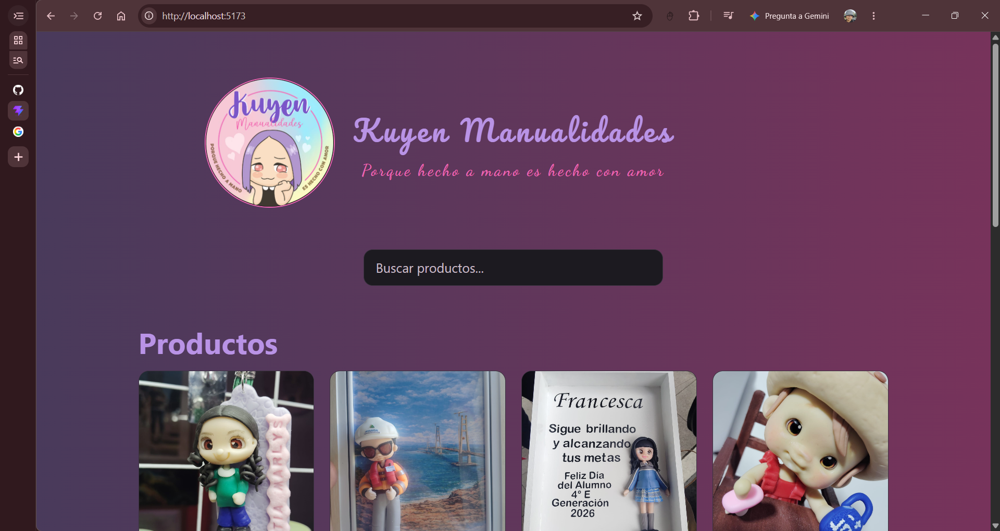
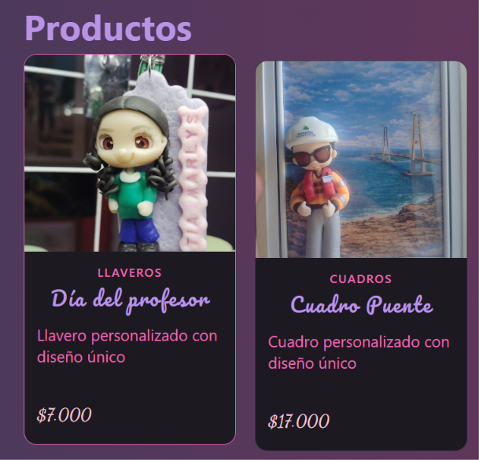

# Kuyen Manualidades

## Descripción

Catálogo de e-commerce de manualidades y recuerdos personalizados, desarrollado para la tarea **Componentes Custom para E-commerce en React**. Presenta ocho productos con fotografía, nombre, categoría, descripción y precio en pesos chilenos. La búsqueda permite filtrar por nombre o categoría.

### Capturas de pantalla

#### Vista general del encabezado



#### Detalle de las tarjetas



## Componentes creados

| Componente | Responsabilidad y props |
| --- | --- |
| `Header` | Muestra el logo, nombre de la tienda y lema. |
| `SearchBar` | Input controlado mediante las props `value` y `onChange`. |
| `ProductCard` | Recibe `product` por props y muestra `name`, `price`, `image` y `category`, además de la descripción. |
| `ProductList` | Recibe `products` y genera tarjetas con `map` y `key={product.id}`. |
| `Footer` | Presenta información de Kuyen y enlaces a Instagram, correo y WhatsApp. |

`App` compone la página y administra la búsqueda con `useState`. Los datos simulados están en `src/data/products.ts`: cada producto tiene `id`, `name`, `price`, `category` e `image`. El campo opcional `priceFrom` permite mostrar «Desde» antes del precio.

## Cómo correr localmente

Requisitos: **Node.js 24 o superior** y npm. Para descargar el repositorio también se necesita Git.

```bash
git clone https://github.com/rsiolquen/kuyen-ecommerce.git
cd kuyen-ecommerce
npm ci
npm run dev
```

Si ya tienes el proyecto, abre una terminal en su carpeta y ejecuta los dos últimos comandos. `npm ci` instala las versiones registradas en `package-lock.json`.

Abre la dirección que indique Vite en la terminal, normalmente `http://localhost:5173/`. Para detener el servidor, presiona `Ctrl + C`.

### Comprobaciones y compilación

```bash
npm run lint
npm run build
npm run preview
```

`build` comprueba TypeScript y genera la carpeta `dist`. Después, `preview` permite revisar esa compilación localmente en la dirección indicada en la terminal.

## Estructura del proyecto

```text
Kuyen-Ecommerce/
├── docs/
│   └── screenshots/
├── src/
│   ├── assets/
│   │   ├── logo/
│   │   └── products/
│   ├── components/
│   │   ├── Header/
│   │   ├── SearchBar/
│   │   ├── ProductCard/
│   │   ├── ProductList/
│   │   └── Footer/
│   ├── data/
│   │   └── products.ts
│   ├── App.tsx
│   ├── App.css
│   ├── index.css
│   └── main.tsx
├── README.md
├── package.json
└── package-lock.json
```

Cada componente tiene su archivo `.tsx` y su archivo `.css`. El catálogo utiliza datos locales; el alcance de esta entrega es la composición, las props, el estado y el renderizado de listas.

Las carpetas de imágenes contienen fotografías adicionales que se consideraron para ampliar el catálogo. Para mantener esta entrega ajustada a la rúbrica, se seleccionaron ocho productos. Las imágenes restantes se conservan para incorporar más productos en el futuro.

## Stack

- React 19 y React DOM.
- TypeScript 6.
- Vite 8.
- CSS con Grid, Flexbox y media queries para adaptar la presentación.
- React Icons para los iconos del footer.
- ESLint, npm y Git.

Las tipografías Pacifico y Dancing Script se cargan desde Google Fonts; si no hay conexión se utilizan las fuentes de respaldo.

## Interacciones

- Búsqueda por nombre o categoría, sin distinguir mayúsculas y minúsculas.

- Actualización del catálogo al escribir mediante el estado de búsqueda con `useState`. Al borrar la búsqueda, se muestran nuevamente los ocho productos.

- Enlaces del footer a Instagram, correo electrónico y WhatsApp.
