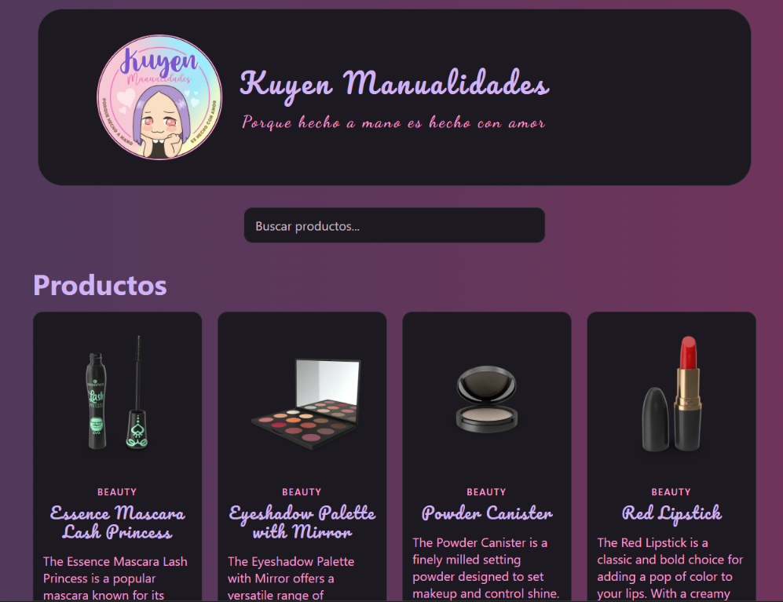
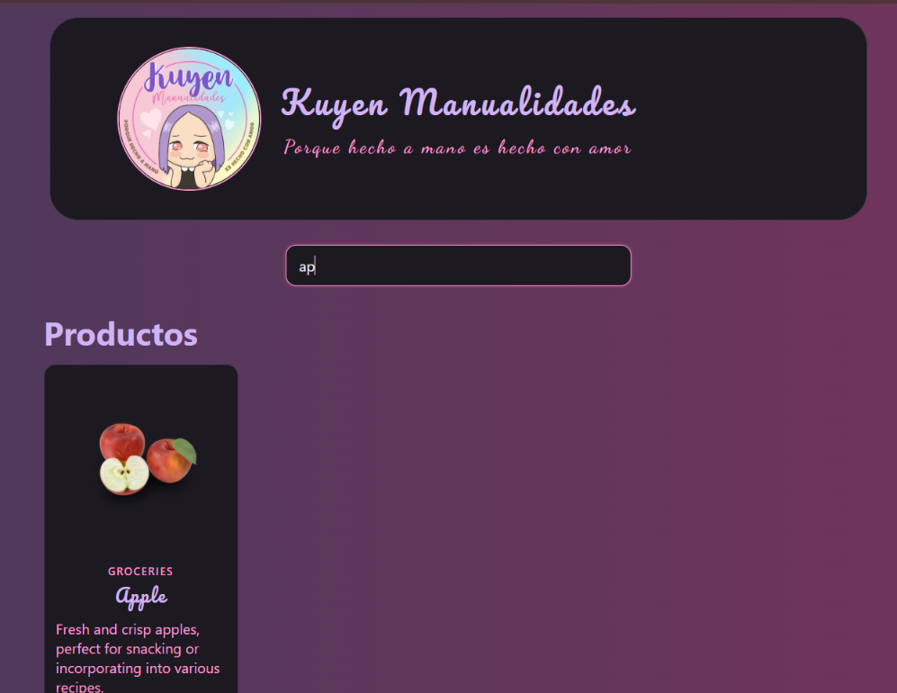
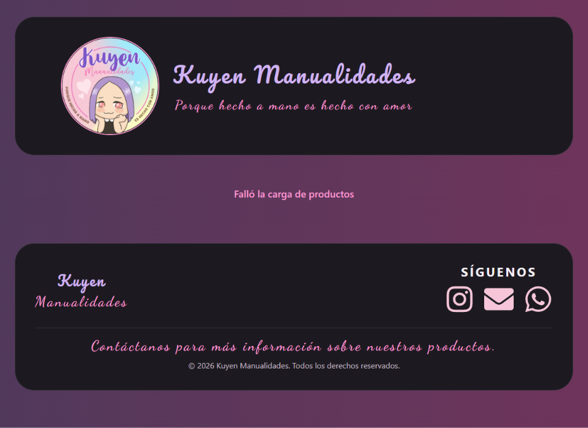

# Kuyen Manualidades — E-commerce en React con consumo de API

Proyecto académico desarrollado con **React, TypeScript y Vite**.

Kuyen Manualidades es una interfaz de e-commerce que consume productos desde la API pública de **DummyJSON**, los renderiza dinámicamente y permite realizar búsquedas por nombre.

La aplicación también contempla estados de carga y error, componentes reutilizables y un diseño responsive adaptado a distintos tamaños de pantalla.

---

## Vista previa

### Vista general



### Búsqueda por nombre



### Estado de error



---

## Funcionalidades

- Consumo de productos desde una API pública.
- Renderizado dinámico del catálogo.
- Búsqueda de productos por nombre.
- Input de búsqueda controlado con estado de React.
- Estado visual de carga mientras se realiza la petición.
- Manejo de errores cuando falla la API.
- Mensaje cuando una búsqueda no encuentra resultados.
- Componentes reutilizables mediante props.
- Diseño responsive para escritorio, tablet y dispositivos móviles.
- Enlaces de contacto y redes sociales en el footer.

---

## Consumo de API

La aplicación utiliza la API pública de DummyJSON:

```text
https://dummyjson.com/products
```

La petición se realiza mediante `fetch` dentro de `useEffect`.

Durante este proceso se administran los siguientes estados:

- `productsDJ`: productos obtenidos desde DummyJSON.
- `loading`: indica si la petición sigue en proceso.
- `error`: almacena el mensaje de error si la solicitud falla.
- `search`: almacena el contenido ingresado en el buscador.

El flujo principal es:

```text
DummyJSON
    ↓
fetch + useEffect
    ↓
productsDJ
    ↓
filtro por nombre
    ↓
ProductList
    ↓
ProductCard
```

Mientras la petición está en curso se muestra el componente `Loader`.

Si la solicitud falla, se muestra `ErrorMessage`.

Cuando los datos se obtienen correctamente, los productos son enviados a `ProductList` para renderizar sus respectivas tarjetas.

---

## Búsqueda

`SearchBar` funciona como un input controlado.

Cada vez que cambia el texto ingresado, React actualiza el estado `search` y vuelve a calcular los productos que coinciden con el término buscado.

La búsqueda se realiza utilizando el nombre del producto (`title`) y no distingue entre mayúsculas y minúsculas.

```text
Usuario escribe
      ↓
setSearch()
      ↓
React actualiza el estado
      ↓
filteredProducts
      ↓
ProductList
```

Si no existen coincidencias, se muestra un mensaje informando que no se encontraron productos.

Al borrar el contenido del buscador, vuelven a mostrarse todos los productos obtenidos desde la API.

---

## Componentes

| Componente | Función |
| --- | --- |
| `Header` | Muestra el logo, nombre de Kuyen Manualidades y lema de la tienda. |
| `SearchBar` | Input controlado para buscar productos por nombre. |
| `ProductCard` | Recibe un producto mediante props y muestra imagen, categoría, nombre, descripción y precio. |
| `ProductList` | Recibe los productos y genera las tarjetas mediante `map` y `key={product.id}`. |
| `Loader` | Indicador visual mientras se espera la respuesta de la API. |
| `ErrorMessage` | Informa al usuario cuando ocurre un error al obtener los productos. |
| `Footer` | Contiene información de Kuyen y enlaces a Instagram, correo y WhatsApp. |
| `CatalogPage` | Administra el consumo de la API, productos, búsqueda, carga y errores. |

---

## Diseño responsive

La interfaz fue desarrollada utilizando **CSS, Flexbox, Grid y media queries**.

Se realizaron ajustes para distintos tamaños de pantalla:

- Escritorio.
- Tablet.
- Dispositivos móviles.
- Pantallas pequeñas cercanas a 375 px.

El catálogo adapta automáticamente la cantidad de columnas según el espacio disponible.

El Header también cambia su distribución dependiendo del ancho de pantalla para mantener el logo, nombre y lema correctamente organizados.

---

## Accesibilidad y legibilidad

La paleta de colores fue revisada para mejorar el contraste entre texto y fondo.

Se utilizan superficies oscuras junto con colores claros para facilitar la lectura y mantener la identidad visual de Kuyen Manualidades.

También se consideraron:

- Contraste.
- Espaciado.
- Jerarquía visual.
- Tamaños de texto.
- Legibilidad.
- Adaptación a distintas resoluciones.

Las tipografías decorativas se utilizan principalmente para elementos de identidad visual, mientras que los textos generales utilizan una fuente de sistema más legible.

---

## Ejecutar el proyecto

### Requisitos

- Node.js.
- npm.
- Conexión a internet para obtener productos e imágenes desde DummyJSON.
- Git, si se desea clonar el repositorio.

### Clonar

```bash
git clone https://github.com/rsiolquen/kuyen-ecommerce.git
```

Ingresar al proyecto:

```bash
cd kuyen-ecommerce
```

Instalar las dependencias:

```bash
npm ci
```

Ejecutar el servidor de desarrollo:

```bash
npm run dev
```

Vite mostrará en la terminal la dirección local de la aplicación, normalmente:

```text
http://localhost:5173/
```

Para detener el servidor:

```text
Ctrl + C
```

---

## Verificación y compilación

Ejecutar ESLint:

```bash
npm run lint
```

Generar una compilación de producción:

```bash
npm run build
```

Revisar la compilación localmente:

```bash
npm run preview
```

---

## Tecnologías utilizadas

- React.
- TypeScript.
- Vite.
- Fetch API.
- DummyJSON Products API.
- CSS.
- CSS Grid.
- Flexbox.
- Media queries.
- React Icons.
- Google Fonts.
- ESLint.
- npm.
- Git y GitHub.

### Tipografías

La identidad visual utiliza:

- **Pacifico**
- **Dancing Script**

Las tipografías se cargan mediante Google Fonts.

Para los textos generales se utilizan fuentes de sistema como respaldo.

---

## Organización del proyecto

```text
Kuyen-Ecommerce/
│
├── docs/
│   └── screenshots/
│       ├── vista-general.png
│       ├── busqueda.png
│       └── ErrorMessage.png
│
├── src/
│   ├── assets/
│   │   └── logo/
│   │
│   ├── components/
│   │   ├── Header/
│   │   ├── SearchBar/
│   │   ├── ProductCard/
│   │   ├── ProductList/
│   │   ├── Loader/
│   │   ├── ErrorMessage/
│   │   └── Footer/
│   │
│   ├── pages/
│   │   ├── CatalogPage.tsx
│   │   └── CatalogPage.css
│   │
│   ├── App.tsx
│   ├── App.css
│   ├── index.css
│   └── main.tsx
│
├── README.md
├── package.json
└── package-lock.json
```

Cada componente mantiene separados sus archivos `.tsx` y `.css`, ayudando a mantener una estructura modular y ordenada.

Los productos del catálogo ya no dependen de los datos locales utilizados en la primera entrega: en esta evaluación se obtienen directamente desde DummyJSON.

---

## Estados de la aplicación

### Carga

Mientras se espera la respuesta de la API:

```text
loading = true
        ↓
Loader
```

### Datos cargados

Cuando la petición termina correctamente:

```text
DummyJSON
   ↓
productsDJ
   ↓
ProductList
   ↓
ProductCard
```

### Error

Si ocurre un problema durante la petición:

```text
fetch falla
    ↓
catch
    ↓
error
    ↓
ErrorMessage
```

---

## Pruebas realizadas

Durante el desarrollo se comprobó:

- Carga correcta de productos desde DummyJSON.
- Renderizado de las tarjetas.
- Búsqueda por nombre.
- Búsqueda sin resultados.
- Estado de carga.
- Estado de error.
- Visualización en escritorio.
- Visualización en tablet.
- Visualización móvil.
- Adaptación aproximada a 375 px.
- Contraste y legibilidad de la interfaz.

---

## Contacto

El footer incluye accesos a:

- Instagram.
- Correo electrónico.
- WhatsApp.

---

## Contexto académico

Proyecto desarrollado para el **Módulo 2 — Desarrollo de Interfaces Dinámicas con React**.

Evaluación:

**E-commerce en React con consumo de API**.